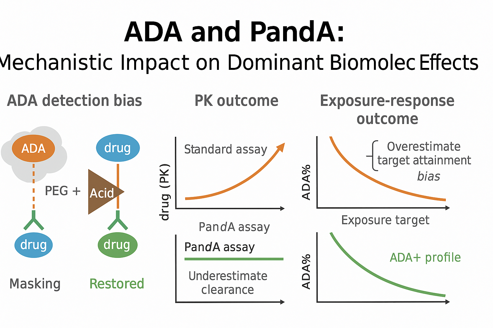

# `ada-panda-mini`

*A minimal, reproducible simulation of ADA drug interference and PandA correction.*

👉 For background on **why ADA assays matter, case studies, pharma workflows, and the role of data science**, see [introduction.md](./introduction.md).



## 🚀 Executive Summary

- **Problem:** Standard ADA assays underestimate immunogenicity at therapeutic drug levels due to drug interference.  
- **Solution:** This repo simulates **PandA (PEG + Acid) correction**, showing how it restores ADA detection, improves drug tolerance, and reduces assay bias.  
- **Impact:** Demonstrates how **bioanalytical method choice** affects PK, exposure–response, and dose justification, with outputs formatted for **regulatory reports** and **digital health standards**.

---

## 🔬 Purpose

Therapeutic drug in serum can **mask anti-drug antibodies (ADA)** in bridging immunoassays, causing **false negatives** and **underestimation of immunogenicity**.  
The **PandA method** (*PEG precipitation + Acid dissociation*) was developed to overcome this interference and achieve **high drug tolerance** in ADA detection.

This repo provides a **minimal, reproducible simulation** of:

- How **drug interference** biases ADA recovery in a standard assay  
- How **PandA-style correction** restores ADA detection  
- How this difference propagates to **PK exposure, target attainment, and dose recommendations**  
- How results align with **literature benchmarks** and **regulatory expectations**  

---

## 📚 Literature anchors

- **Zoghbi et al., 2015**: Original PandA paper; shows PEG + acid dissociation achieves high drug tolerance. PMID: [26255760](https://pubmed.ncbi.nlm.nih.gov/26255760/)  
- **FDA Immunogenicity Assay Guidance (2019)**: Assay validation, drug tolerance, and tiered testing strategy. [PDF](https://www.fda.gov/media/119788/download)  
- **Celerion Poster (2020)**: PandA detected 10 ng/mL ADA at **800 µg/mL drug** — dramatic improvement vs bridging.  
- **Sanofi EBF 2024**: Practical defaults: **6% PEG precip**, **3% PEG wash**, **acetic acid 300 mM (pH 2.5–3.5, ~30–45 min)**; caution that ≥60 min acid can reduce ADA signal. [PDF](https://e-b-f.eu/wp-content/uploads/2024/01/D1-44.-Brendy-Van-Butsel-Ortwin-Vande-Vyver-sanofi.pdf)  

---

## 🧪 Method overview

**PandA critical steps:**
1. **Complex formation**: Saturate ADA with drug to capture all ADA.  
2. **PEG precipitation**: 6% PEG (cold), pellet complexes, wash ×2 with 3% PEG.  
3. **Acid dissociation & coating**: Acetic acid 300–500 mM (pH 2.5–3.5), 30–45 min, coat directly on high-bind plates under acidic conditions.  
4. **Detection**: Specific anti-Ig detection (e.g. ECL), blockers & buffers tuned to reduce background.

**Trade-offs:**  
- Too harsh acid or long incubation (≥60 min) can damage ADA → reduce dynamic range.  
- Method chosen based on **required drug tolerance**: bridging OK up to low µg/mL; PandA for ≥100s µg/mL to mg/mL.  

---

## 🖼️ PandA Workflow (schematic)


*PandA improves ADA drug tolerance by precipitating complexes (PEG), 
acid-dissociating them under controlled pH, and detecting freed ADA with 
specific anti-Ig reagents. Default parameters shown are industry-reported 
(Sanofi, 2024).*

---

## 📊 What this repo simulates

- **01_simulate**: Generate synthetic PK + true ADA titers.  
- **02_measure**: Apply drug-dependent masking (standard assay bias).  
- **03_panda**: Apply PandA-style correction; compare vs true ADA.  
- **04_benchmark_vs_literature**: Overlay simulated recovery vs literature thresholds; flag **PASS/ALERT**.  

**Outputs (`/reports`):**
- `tlgs.parquet`:  
  - `drug_tolerance` (drug conc vs recovery)  
  - `ada_bias` (measured vs true vs corrected)  
  - `target_attainment` (% above threshold exposure)  
- `benchmarks.parquet`: PASS/ALERT flags  
- Figures:  
  - Drug tolerance curve  
  - ADA time series (True vs Measured vs PandA)  
  - Bias vs drug concentration  
  - Target attainment impact  
  - PASS/ALERT heatmap  

---

## 🛠️ Method parameters (defaults)

These reflect Sanofi’s EBF 2024 “default PandA,” safe for most programs:

```yaml
PEG_precip: 6% (cold)
PEG_wash: 3% (×2)
Acid: Acetic acid 300 mM, pH 2.8–3.2
Acid_time: 30–45 min
```
## Tuning guide (beginner-friendly):
- Need higher tolerance (>mg/mL drug): consider Glycine-HCl (10–50 mM, pH 2.5–3.0).
- Low recovery: adjust PEG % (5–7%), shorten acid incubation, test alternative acids.
- Signal loss/dynamic range shrinkage: avoid acid ≥60 min, reduce acid strength, check for ADA denaturation.
- High background: optimize molar excess of labeled reagents, blockers, wash rigor.

## 🧾 Validation metrics (aligned to FDA 2019)
- Sensitivity: lowest ADA concentration reliably detected (LLOQ).
- Drug tolerance: max drug concentration where recovery ≥80%.
- Target interference: confirm assay still detects ADA in presence of target antigen.
- Specificity: confirmatory inhibition with drug.
- Precision: intra-/inter-assay CVs for NC/LPC/HPC.
- Cut-points: Screening (SCP) & Confirmatory (CCP) derived from NCs.

## ▶️ How to run
```bash
git clone https://github.com/YOURNAME/ada-panda-mini
cd ada-panda-mini
mamba env create -f env.yml
mamba activate ada-panda
make all   # runs 01→04, saves figures + tlgs + benchmarks
```
Outputs will appear in /reports.

## 📈 Results

### 1. Drug tolerance: Sim vs Literature


**Interpretation:**  
- The **standard bridging assay (sim & lit)** loses recovery above ~10 µg/mL, confirming poor drug tolerance.  
- The **PandA assay** maintains ≥80% recovery up to ~200 µg/mL (sim) and ~1000 µg/mL (lit), in line with published benchmarks.  
- **Regulatory meaning:** PandA meets FDA-style drug tolerance expectations, while standard fails.

---

### 2. PASS/ALERT benchmarks


**Interpretation:**  
- **Standard assays (sim & lit)** fail the ≥80% recovery cutoff (ALERT).  
- **PandA assays (sim & lit)** PASS at therapeutic drug levels.  
- **Regulatory meaning:** simple benchmark summary for validation reports.

---

### 3. ADA incidence detection bias


**Interpretation:**  
- **Standard assay** underestimates ADA incidence (~25–30%).  
- **PandA assay** restores incidence (~37–40%), closer to the simulated truth (~38–41%).  
- **Regulatory meaning:** without correction, immunogenicity risk is understated.

---

### 4. Detected ADA vs exposure
  


**Interpretation:**  
- At **week 52**, ADA+ subjects show lower troughs than ADA−, but the effect is muted if ADA is detected only by standard assays.  
- **PandA detection** better separates ADA+ vs ADA− exposure distributions.  
- **Regulatory meaning:** assay choice changes interpretation of PK impact.

---

### 5. True exposure–response


**Interpretation:**  
- True ADA+ subjects cluster at lower drug levels and reduced efficacy probability.  
- The fitted E–R curve confirms lower target attainment when ADA is present.  
- **Regulatory meaning:** bioanalytical bias propagates into PK/PD and efficacy models.

---

## 🧾 Summary

- **Assay artifact:** Standard bridging assays underestimate ADA incidence and PK impact.  
- **Solution:** PandA improves drug tolerance, restores ADA detection, and reduces bias.  
- **Downstream impact:** Corrected ADA detection changes PK, exposure–response, and dose justification.  
- **Regulatory alignment:** Matches FDA/EMA expectations to document drug tolerance validation and justify assay choice.

---

## 📬 Contact
Carlos Montefusco
📧 cmontefusco@gmail.com
🔗 GitHub: /camontefusco
